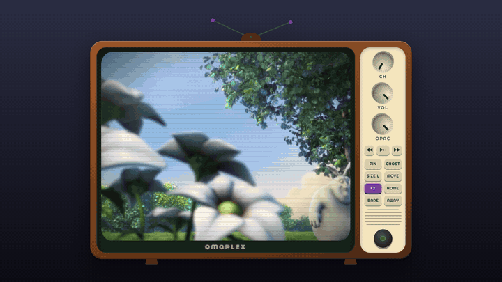
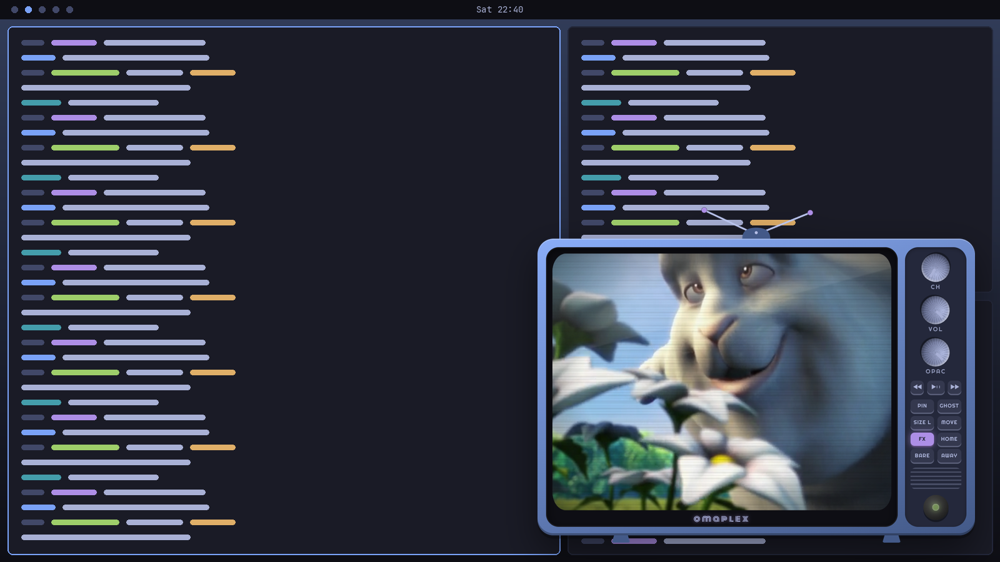
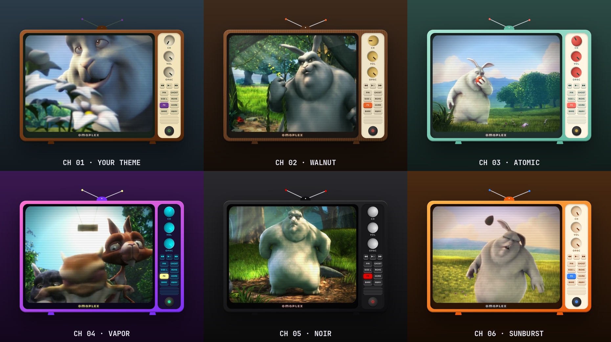
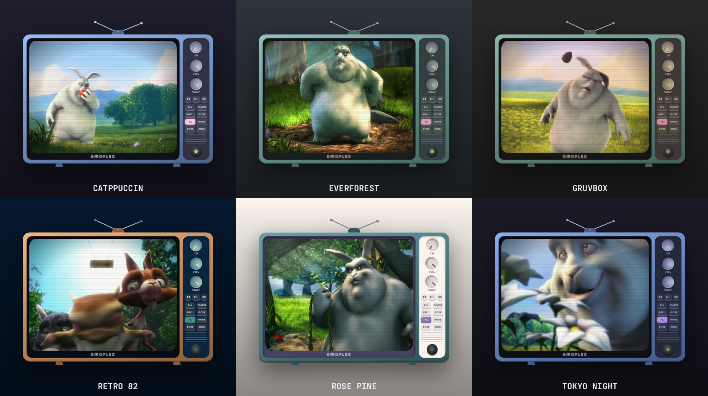
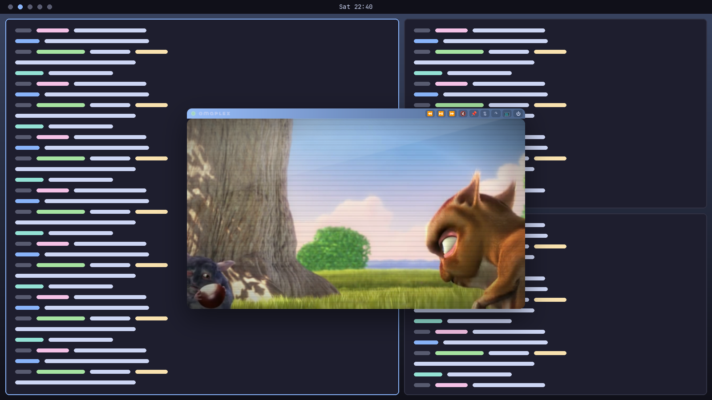

<p align="center">
  
</p>

<h1 align="center">omaplex</h1>

<p align="center">
  <b>A funky floating CRT television for Plex on <a href="https://omarchy.org">Omarchy</a>.</b><br>
  It hovers over your tiling grid, follows you across workspaces, and wears your theme.<br>
  <a href="https://squatchware.dev/omaplex/">squatchware.dev/omaplex</a>
</p>

<p align="center">
  
  
  
  
</p>

Tiling window managers are great until you want something on in the corner.
omaplex puts Plex in a little TV set that never takes a tile: rabbit ears,
chunky knobs, scanlines, static between channels and a CRT switch-off when
you power down. Think [Afloat](https://afloat.en.softonic.com/mac) for
Hyprland, with more wood grain.



## Install

Needs Omarchy with the Lua Hyprland config (Hyprland 0.56+), plus `git`, `jq` and `npm`
(`omarchy pkg add nodejs npm` if you don't have them).

```sh
curl -fsSL https://raw.githubusercontent.com/squatchware/omaplex/main/install.sh | bash
```

Or from a checkout (read `install.sh` first, it's short):

```sh
git clone https://github.com/squatchware/omaplex && cd omaplex && ./install.sh
```

### Arch package

Prefer pacman to track it? Build the package (it runs on Arch's system `electron`), then wire it into Hyprland as your user:

```sh
git clone https://github.com/squatchware/omaplex && cd omaplex/packaging && makepkg -si
omaplex setup            # Hyprland rule, Super + Alt + P and the theme hook
```

Before `pacman -R omaplex`, run `omaplex setup --remove`. An AUR package is on the way once AUR sign-ups reopen.

### Then

Press <kbd>Super</kbd> + <kbd>Alt</kbd> + <kbd>P</kbd>, sign in to Plex once, and you're watching.
Pick a different key with `OMAPLEX_KEY="SUPER + SHIFT + T" ./install.sh`, or `OMAPLEX_KEY=none` for no binding.
The installer skips the binding if the key is already taken.

## Keys & commands

| Key / command | Action |
|---|---|
| <kbd>Super</kbd> + <kbd>Alt</kbd> + <kbd>P</kbd> | Turn on, then toggle between stashed (keeps playing) and on screen |
| `omaplex` | Launch, or focus the TV if it's already on |
| `omaplex toggle` | Same as the keybinding |
| `omaplex reload-theme` | Repaint from the current Omarchy theme (the theme hook runs this for you) |
| `omaplex setup` | Add the Hyprland rule, keybinding and theme hook (`--remove` to take them out) |
| `omaplex play-pause` · `next` · `previous` · `forward` · `back` | Control the TV directly, whichever other player is active. Handy for a keybinding of your own |
| `omaplex profile NAME [PIN]` | Same as the 📌 on Plex's "Select User" screen: boot straight into that Home profile (`--clear` to stop) |
| <kbd>Super</kbd> + drag | Move (or grab the cabinet or antennas) |
| <kbd>Super</kbd> + right-drag | Resize freely. omaplex remembers where you left it until you pick a SIZE or MOVE preset |

## The controls

| Control | What it does |
|---|---|
| **CH** knob | Click, scroll or right-click to change channel (the TV's skin) |
| **VOL** knob | Scroll or drag for volume, click to mute |
| **OPAC** knob | Scroll or drag to fade the whole set from 25 to 100% |
| ◀◀ · ▶❚❚ · ▶▶ | Back 10s · play/pause · forward 30s. Right-click ◀◀ / ▶▶ for the previous / next item |
| **PIN** | Show on every workspace (Hyprland `pin`) |
| **GHOST** | Fade right down whenever the TV isn't focused |
| **SIZE** | Small / medium / large |
| **MOVE** | Hop to the next screen corner |
| **FX** | Scanlines, vignette and glass glare |
| **HOME** | Back to the Plex home screen |
| **AWAY** | Pause when you stash the TV, resume when you bring it back |
| **BARE** | Lose the cabinet: a clean 16:9 screen with a slim remote strip |
| ⏻ | CRT switch-off, then quit |

The speaker grille thumps while something's playing, and each new title gets a caption
across the bottom of the screen. Bare mode's remote strip has the
same transport buttons and mute.

Media keys work too: omaplex shows up as an MPRIS player, so Omarchy's play/pause and
next/previous keys (and `playerctl`) control whatever's on the TV.

## Skip "Who's watching"

A Plex Home account opens on the profile picker at every launch. omaplex adds a 📌 to each
profile on that screen: click one and the TV boots straight into that profile from then on.
If the profile has a PIN, the TV asks for it once. Click the lit pin again to get the picker
back; while a profile is pinned, Plex's own **Switch User** menu still takes you there.

Or from a terminal:

```sh
omaplex profile Jim          # the name on the profile's tile, any case
omaplex profile Kids 1234    # with the profile's PIN
omaplex profile --clear      # back to the picker
```

The name and PIN live in `~/.config/omaplex/state.json` (readable only by you). You can still
switch users any time; omaplex only steps in when Plex first loads.

## Channels



## It wears your theme

Channel 1 builds the cabinet, panel, knobs, antennas and on-screen text from your
current Omarchy theme's `colors.toml`. When you run `omarchy theme set`, a
`theme-set` hook repaints it (with a burst of static) without restarting.



## Bare mode



## Files it touches

| Path | What |
|---|---|
| `~/.config/hypr/omaplex.lua` | Window rule (float, pin, no border/shadow/blur) and the keybinding. Owned by omaplex |
| `~/.config/hypr/hyprland.lua` | One line appended, ending in `-- omaplex`, that loads the file above via `require_optional` (backed up first) |
| `~/.config/omarchy/hooks/theme-set.d/omaplex` | Theme hook, installed with `omarchy hook install` |
| `~/.local/bin/omaplex` | Launcher symlink |
| `~/.local/share/applications/omaplex.desktop` | Launcher entry |
| `~/.config/omaplex/` | Your settings (`state.json`, including any auto-login profile and PIN) and Plex login |

Want it in the Omarchy menu too? Add this to `~/.config/omarchy/extensions/omarchy-menu.jsonc`:

```jsonc
"omaplex": { "icon": "󰔂", "label": "Plex TV", "action": "omaplex toggle" }
```

## Config

`~/.config/omaplex/state.json` holds everything the knobs set. To go straight to
your own server instead of app.plex.tv, set `"url"`, for example `"http://my-server:32400/web"`.

## Uninstall

```sh
~/.local/share/omaplex/install.sh --uninstall   # or ./install.sh --uninstall from your checkout
```

This removes everything in the table above except `~/.config/omaplex`.

## Known limits

- Built for Omarchy/Hyprland only. It drives the window with `hyprctl` and relies on Omarchy's Lua config.
- It's Electron, so expect ~250 MB of RAM. Your own Plex media plays fine; DRM-protected streams may not, because stock Electron ships without Widevine.
- Stashing keeps playback going. Pause first if you want silence.

## Screenshots

Everything in `docs/` is generated by `npm run capture`. It runs an isolated
instance (separate profile, no Plex login) that plays
[Big Buck Bunny](https://peach.blender.org/) instead of a real library, then
composites the shots.

## Credits

- Demo footage: *Big Buck Bunny* © Blender Foundation, [CC BY 3.0](https://creativecommons.org/licenses/by/3.0/).
- Fonts: [Monoton](https://fonts.google.com/specimen/Monoton) and [Righteous](https://fonts.google.com/specimen/Righteous) (SIL OFL).

omaplex is an independent project and is not affiliated with or endorsed by Plex, Inc.
It's a window onto Plex's own web app; you'll need a Plex account.

## License

[MIT](LICENSE)
